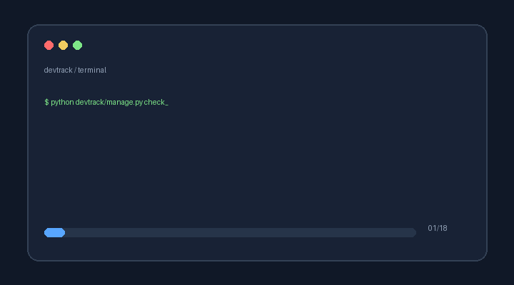

# Local development setup



## Prerequisites

- Python 3.12 or newer
- pip
- PowerShell, Bash, or another terminal
- Internet access for installing dependencies

## 1. Create and activate a virtual environment

Windows PowerShell:

```powershell
py -3 -m venv .venv
.\.venv\Scripts\Activate.ps1
```

Linux/macOS:

```bash
python3 -m venv .venv
source .venv/bin/activate
```

## 2. Install dependencies

```bash
python -m pip install --upgrade pip
pip install -r requirements.txt
```

## 3. Prepare the database

```bash
python manage.py migrate
```

## 4. Run checks

```bash
python manage.py check
python manage.py makemigrations --check --dry-run
```

The project currently has no committed test module, so `python manage.py test` completes with zero tests. Add focused API tests before requiring a test-count gate in CI.

## 5. Start the API

```bash
python manage.py runserver
```

The API is available at `http://127.0.0.1:8000/api/`.

## 6. Open interactive API documentation

- Swagger UI: `http://127.0.0.1:8000/api/docs/`
- OpenAPI schema: `http://127.0.0.1:8000/api/schema/`

Use Swagger UI's **Try it out** action to create events, reserve seats, filter records, and cancel reservations.

## Environment variables

For production, configure:

- `DJANGO_SECRET_KEY`
- `DJANGO_DEBUG=False`
- `DJANGO_ALLOWED_HOSTS`, as a comma-separated host list

Local development uses a development secret and allows `localhost` and `127.0.0.1` by default.

## Troubleshooting

1. If Django cannot be imported, activate `.venv` and run `pip install -r requirements.txt`.
2. If the database is missing, run `python manage.py migrate`.
3. If Swagger returns an error, run `python manage.py check` and confirm `drf-spectacular` is installed.
4. If the host is rejected, add the hostname to `DJANGO_ALLOWED_HOSTS`.
5. If a reservation is rejected, check the event status and current `available_seats` value.
